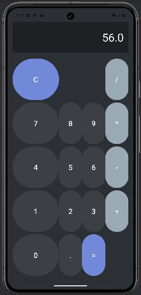

# Calculadora para Programação de Dispositivos Móveis

Este é um projeto de calculadora desenvolvido para a disciplina de Programação de Dispositivos Móveis. A aplicação tem como objetivo fornecer uma interface simples e intuitiva para realizar operações matemáticas básicas, como adição, subtração, multiplicação e divisão.

## Imagem do Projeto

  <!-- Ajuste o caminho e o nome do arquivo da imagem conforme necessário -->

## Funcionalidades

- Interface amigável e responsiva
- Operações matemáticas básicas:
  - Adição
  - Subtração
  - Multiplicação
  - Divisão
- Limpar entrada
- Exibir resultados em tempo real

## Tecnologias Utilizadas

- Android SDK
- Java/Kotlin (dependendo da linguagem que você utilizou)
- XML para layout de interface

## Instalação

1. Clone este repositório:
   ```bash
   git clone https://github.com/seu-usuario/nome-do-repositorio.git
